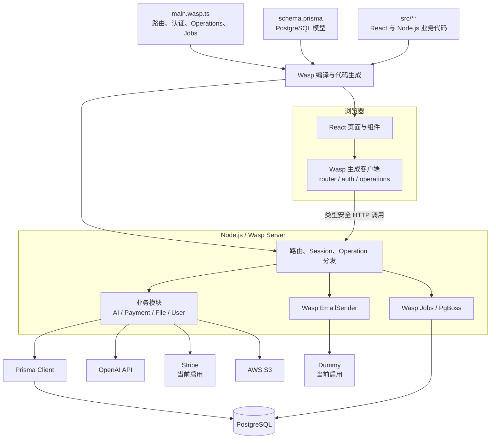

# 仓库结构与运行时架构

## 1. 仓库性质

这个仓库不是单一的可部署应用目录，而是 Open SaaS 模板、官方演示站、文档和模板测试工具的组合仓库。

真正用于 `wasp new -t saas` 的规范模板位于 `template/`。其中 `template/app/` 是 Wasp 全栈应用，`template/blog/` 是 Astro/Starlight 博客模板，`template/e2e-tests/` 是 Playwright 端到端测试。

```text
open-saas-china/
├─ .github/                 CI、模板发布、E2E 和文档部署工作流
├─ template/                Open SaaS 的规范模板源
│  ├─ app/                  Wasp SaaS 应用
│  ├─ blog/                 Astro/Starlight 博客与文档模板
│  └─ e2e-tests/            Playwright 端到端测试
├─ opensaas-sh/
│  ├─ blog/                 docs.opensaas.sh 的实际文档与博客
│  └─ app_diff/             官方演示站相对 template/app 的补丁
├─ template-test/           正式发布模板的集成验证补丁与流程
├─ tools/                   diff、patch 和 Wasp 辅助脚本
├─ docs/                    本仓库的架构与适配说明
├─ package.json             仓库级 ESLint、Prettier 工具
└─ README.md
```

相关仓库说明：

- [`template/README.md`](../../template/README.md)
- [`opensaas-sh/README.md`](../../opensaas-sh/README.md)
- [`template-test/README.md`](../../template-test/README.md)
- [`tools/README.md`](../../tools/README.md)
- [`CONTRIBUTING.md`](../../CONTRIBUTING.md)

## 2. `template/app` 目录职责

Open SaaS 采用按业务功能纵向拆分的结构。一个业务目录通常同时包含 React 页面、Node.js 服务端 Operation 和 Wasp Spec，而不是把整个项目机械地拆成 `frontend/` 和 `backend/` 两棵目录。

| 路径 | 当前职责 |
|---|---|
| [`main.wasp.ts`](../../template/app/main.wasp.ts) | Wasp 总装配入口，注册认证、页面、路由、Action、Query、API、Job 和邮件 |
| [`schema.prisma`](../../template/app/schema.prisma) | PostgreSQL 数据模型和关系 |
| `public/` | 静态资源、favicon、robots 和 LLM 文本 |
| `src/admin/` | 管理后台页面、布局和仪表盘 |
| `src/analytics/` | 统计查询、定时任务和分析 Provider 代码 |
| `src/auth/` | 登录注册页面、认证配置、OAuth 字段映射和认证邮件内容 |
| `src/client/` | React 根组件、导航、共享 UI、Hooks、样式和静态资源 |
| `src/demo-ai-app/` | AI 日程示例、任务 CRUD、额度判断和 OpenAI 调用 |
| `src/file-upload/` | S3 预签名上传、下载、删除和文件管理页面 |
| `src/landing-page/` | 落地页、营销组件和内容 |
| `src/payment/` | 套餐、结账、Webhook 和多个支付 Provider 实现 |
| `src/server/` | 服务端公共验证、邮件配置和数据库种子 |
| `src/shared/` | 前后端共享工具和常量 |
| `src/user/` | 账户页面、用户查询和管理员操作 |

Open SaaS 官方 Guided Tour 也将这种组织方式定义为 vertical feature structure：<https://docs.opensaas.sh/start/guided-tour/>。

## 3. Wasp、React、Node.js、Prisma 的关系

### React

React 运行在浏览器中，负责页面渲染、表单、交互状态和结果展示。业务页面通过 `wasp/client/operations` 调用 Wasp 生成的类型安全客户端函数，不直接访问数据库或第三方密钥。

### Node.js

Node.js 承载 Wasp 服务端运行时，执行：

- Actions 和 Queries；
- 支付 Webhook 等自定义 API；
- Wasp Jobs/PgBoss Worker；
- OpenAI、Stripe、AWS SDK 等第三方调用；
- Prisma 数据库访问。

### Prisma

Prisma 是服务端 ORM。模型定义在 [`schema.prisma`](../../template/app/schema.prisma)，当前 datasource 为 PostgreSQL。

Wasp 会把 Prisma Model 识别为 Wasp Entity。Operation 在 Spec 中声明所需 Entity 后，Wasp 把对应的 Prisma Delegate 注入为 `context.entities.X`。需要跨多个查询或写入的事务时，代码直接使用 `wasp/server` 导出的全局 `prisma`。

### Wasp

Wasp 是编译和编排层，而不是 React、Node.js 或 Prisma 的替代品。它读取：

- [`main.wasp.ts`](../../template/app/main.wasp.ts) 中的 App Spec；
- [`schema.prisma`](../../template/app/schema.prisma) 中的数据模型；
- `src/**` 中的业务实现。

随后生成 React 客户端、Node.js 服务端、路由、认证端点、Operation HTTP 调用、类型定义和 Prisma 接线代码。生成目录通常位于 `.wasp/out`，不应手工修改。

参考：

- Wasp Entities：<https://wasp.sh/docs/data-model/entities>
- Wasp Actions：<https://wasp.sh/docs/data-model/operations/actions>
- Wasp Queries：<https://wasp.sh/docs/data-model/operations/queries>
- Wasp Authentication：<https://wasp.sh/docs/auth/overview>

## 4. 架构图



## 5. 当前架构边界

- 这是一个模块化单体，所有功能默认由同一个 Wasp/Node.js 服务运行。
- 数据库是共享 PostgreSQL，没有按模块独立数据库。
- PgBoss Job 与 Web Server 同进程运行，适合低容量后台任务，但不是独立 AI Worker 服务。
- 普通业务 Action/Query 由 Wasp 生成 HTTP 接口；支付回调则通过 Wasp API 显式暴露。
- `opensaas-sh/app_diff` 是演示站补丁，不是另一个独立架构实现。

## 6. 待验证

- 当前环境没有生成的 `.wasp/out`，因此生成服务端代码没有进行现场检查。
- 本机未运行 Wasp CLI，实际安装版本和编译结果待验证；代码声明版本为 `^0.25.0`。
- 当前没有实际 `.env.server`，第三方连接和部署拓扑待验证。
- 模板目录没有本次运行生成的迁移结果，实际部署数据库状态待验证。
