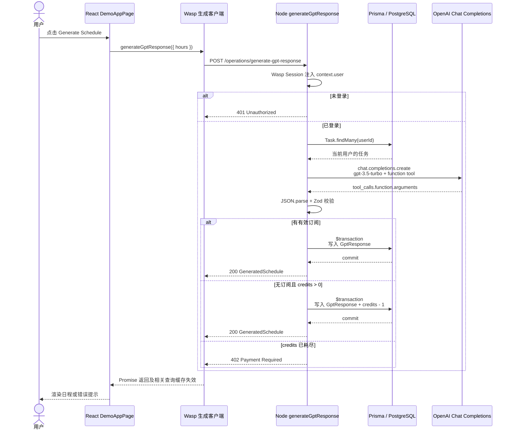

# AI 请求、认证、额度与事务

## 1. 当前 AI 功能定位

当前 AI 能力是 `src/demo-ai-app/` 下的同步日程生成示例，不是独立 AI 平台或工作流引擎。

它具备：

- 用户任务 CRUD；
- OpenAI Chat Completions 调用；
- function calling 结构化输出；
- Zod 返回值校验；
- 简单订阅/credits 控制；
- 最终结果持久化。

它不具备：

- Provider 抽象；
- 流式响应；
- Run ID 和步骤状态；
- 后台执行和失败重试；
- Token/费用记录；
- Provider、模型、延迟和错误审计；
- 工作流暂停、恢复或取消。

## 2. Wasp 注册入口

[`demo-ai-app.wasp.ts`](../../template/app/src/demo-ai-app/demo-ai-app.wasp.ts) 注册了：

- `/demo-app` 页面，并设置 `authRequired: true`；
- `getGptResponses` Query；
- `generateGptResponse` Action；
- Task 的查询和增删改 Actions。

`generateGptResponse` 声明使用 `User`、`Task`、`GptResponse` 三个 Entity。Wasp 因此生成客户端调用函数、服务端 Operation 入口，并根据 Entity 声明处理相关 Query 缓存失效。

## 3. 完整请求链路

前端入口位于 [`DemoAppPage.tsx`](../../template/app/src/demo-ai-app/DemoAppPage.tsx)，服务端实现在 [`operations.ts`](../../template/app/src/demo-ai-app/operations.ts)。

逐步说明：

1. 用户点击 `Generate Schedule`。
2. React 调用 `wasp/client/operations` 导出的 `generateGptResponse({ hours })`。
3. Wasp 客户端向 `/operations/generate-gpt-response` 发送 POST；该路径由 [`demoAppTests.spec.ts`](../../template/e2e-tests/tests/demoAppTests.spec.ts) 直接验证。
4. Wasp 在服务端恢复 Session，并把当前用户放入 `context.user`。
5. Action 自身再次检查 `context.user`，未登录返回 401。
6. Action 读取当前用户的 Task。
7. 同一个文件直接实例化 OpenAI SDK，并调用 `openAi.chat.completions.create`。
8. 模型固定为 `gpt-3.5-turbo`，提示词和 function tool schema 在 Action 文件中构造。
9. 返回的 tool arguments 经 JSON 解析和 [`schedule.ts`](../../template/app/src/demo-ai-app/schedule.ts) 的 Zod Schema 校验。
10. Action 判断订阅或 credits，使用 Prisma 事务保存结果并在需要时扣减额度。
11. Wasp 把结构化结果返回 React，页面更新本地 `response` 并渲染日程。

## 4. 用户认证在哪里处理

认证总配置位于 [`src/auth/auth.wasp.ts`](../../template/app/src/auth/auth.wasp.ts)。

当前事实：

- 当前启用 Email verified auth。
- Google、GitHub、Discord 已有字段映射和配置函数，但 Auth methods 处于注释状态。
- `/demo-app`、`/account`、文件上传页和后台页面设置了 `authRequired: true`。
- 业务 Actions/Queries 通常还会显式检查 `context.user`。
- 管理员 Operations 会继续检查 `context.user.isAdmin`，不是只依赖前端隐藏菜单。
- Wasp 负责凭据、Session、认证端点和客户端 Auth UI。

相关文件：

- [`auth.wasp.ts`](../../template/app/src/auth/auth.wasp.ts)
- [`userSignupFields.ts`](../../template/app/src/auth/userSignupFields.ts)
- [`email-and-pass/emails.ts`](../../template/app/src/auth/email-and-pass/emails.ts)
- [`user/operations.ts`](../../template/app/src/user/operations.ts)

## 5. 订阅和额度在哪里处理

### 数据模型

[`schema.prisma`](../../template/app/schema.prisma) 的 `User` 包含：

- `paymentProcessorUserId`
- `subscriptionStatus`
- `subscriptionPlan`
- `datePaid`
- `credits`，默认值为 3

### 套餐和状态

[`src/payment/plans.ts`](../../template/app/src/payment/plans.ts) 定义：

- `SubscriptionStatus`
- `PaymentPlanId`
- 订阅套餐和一次性 credits 套餐

### 支付侧更新

Stripe、Lemon Squeezy、Polar Webhook 在付款或订阅状态变化后，通过 [`src/payment/user.ts`](../../template/app/src/payment/user.ts) 更新用户订阅字段或增加 credits。

### AI 侧消费

`generateGptResponse` 把以下两种状态视为已经订阅：

- `active`
- `cancel_at_period_end`

其他用户需要消费一个 credit。当前没有独立的 Entitlement、Quota 或 Usage Ledger 模块。

## 6. 显式数据库事务

当前仓库发现三处显式 `$transaction`：

| 位置 | 事务内容 |
|---|---|
| [`demo-ai-app/operations.ts`](../../template/app/src/demo-ai-app/operations.ts) | 保存 `GptResponse`，并在免费用户场景扣减 `User.credits` |
| [`user/operations.ts`](../../template/app/src/user/operations.ts) | 同时读取用户分页结果和符合过滤条件的总数 |
| [`analytics/operations.ts`](../../template/app/src/analytics/operations.ts) | 同时读取当日统计和最近七日统计 |

单条 Prisma `create`、`update`、`delete` 本身由数据库保证单语句原子性，但不构成跨外部系统事务。

## 7. 当前一致性和并发风险

### AI 成本先于额度拒绝

代码先调用 OpenAI，成功返回后才检查用户是否有 credits。零额度用户仍可能产生一次模型调用成本，最后才收到 402。

### 并发超扣

`context.user.credits > 0` 是事务外的快照判断，随后才执行原子 decrement。两个并发请求可能同时看到旧值并都通过判断，导致 credits 被扣成负数。

### 外部 API 不在数据库事务中

OpenAI 请求无法与 PostgreSQL 写入形成同一事务。可能出现“模型调用成功但数据库保存失败”，当前没有用量审计或补偿记录。

### 支付回调缺少幂等记录

Webhook 直接更新用户或增加 credits，没有保存 Provider Event ID。第三方重复投递同一付款事件时，credits 存在重复增加风险。

### 对象存储和数据库不一致

文件上传为“预签名→浏览器上传→对象存在检查→写数据库”；删除为“先删数据库→再删对象”。这些步骤没有跨系统事务或补偿任务。

## 8. AI 工作流前的必要拆分

建议在引入异步 Workflow 之前先拆出：

1. AI Provider：统一结构化生成、能力声明、错误分类和用量信息。
2. Entitlement Service：判断套餐和功能权限。
3. Usage Ledger：额度预留、成功结算、失败退款和审计。
4. Workflow Run：记录运行和步骤状态，不依赖 PgBoss 内部表充当产品数据。

这样同步 AI Action 和未来异步 Workflow 可以复用同一套权限与计费规则。
